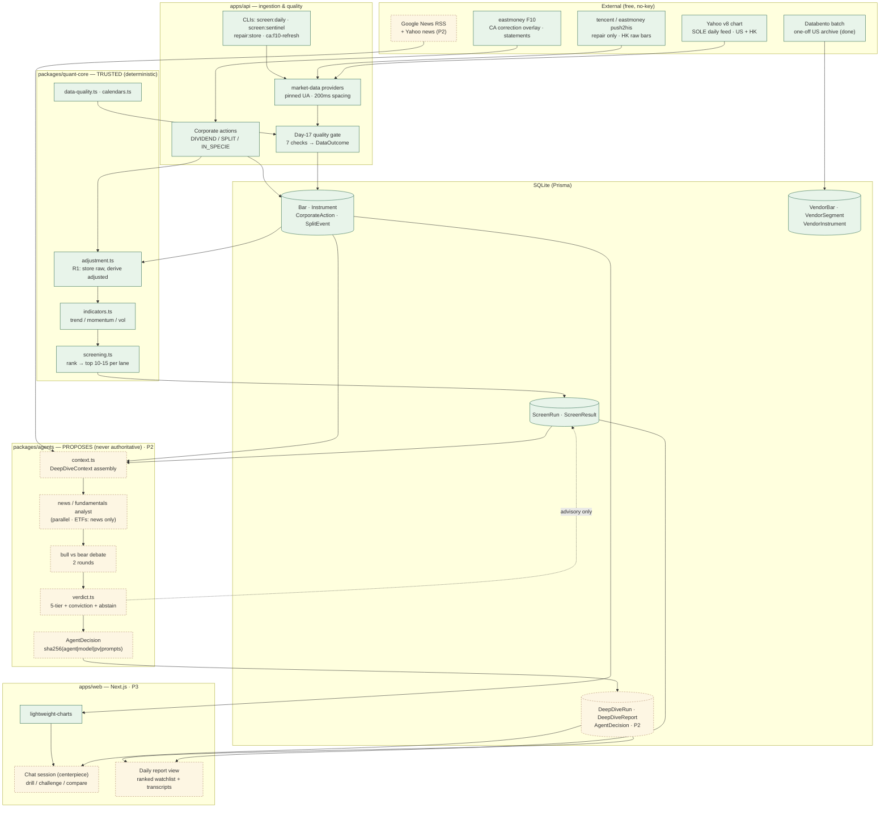
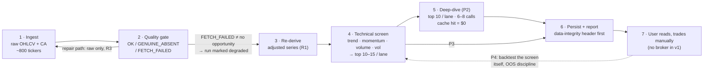
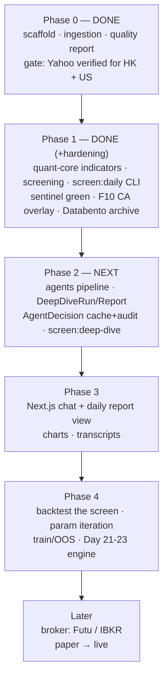

# Architecture Map — as-built + evolution path

Rendered: [`architecture-map.html`](./architecture-map.html) (mermaid via CDN,
regenerate with `pnpm docs:map` after editing this file).

Archify version (validated standalone HTML, self-contained — no CDN):
[`architecture-system-map.html`](./architecture-system-map.html), source
[`architecture-system-map.json`](./architecture-system-map.json). Rebuild with
`node ~/.agents/skills/archify/bin/archify.mjs deliver architecture <spec.json> <out.html> --quality showcase`.

Reference diagram set for `architecture-v1.md` (§1 objective, §3 layout, §5
pipeline, §10 build order). Complements, does not replace it.

Legend: **solid** = shipped · **dashed** = designed, not built ·
`P2`/`P3`/`P4` = phase it lands in.

---

## 1. System map (the one to keep on the wall)

**The rule the diagram encodes:** arrows from `packages/agents` point *into*
storage, never into `quant-core`. Agents propose, the quant core disposes.

---

## 2. Daily data flow (two runs: ~16:45 HKT HK · ~06:00 HKT US)

Data-integrity header (leads every report): *"782/800 screened; 11 Yahoo 429s
retried; 7 halted; 3 excluded for bad adjustments."*

---

## 3. Evolution path

What each phase adds to the map, in one line:

| Phase | New boxes | Why it is last |
|---|---|---|
| 0–1 | ingestion, quality gate, quant-core | the trusted core must be right before an LLM reads its output |
| **2** | `packages/agents` + `DeepDive*`/`AgentDecision` | needs a stable `ScreenRun` to deepen; prompts are byte-deterministic so the cache is real |
| 3 | `apps/web` chat + report | UI is a viewer over persisted runs — nothing to show until reports exist |
| 4 | backtest module | the screen is a *hypothesis*; it needs a history of verdicts (P2) before it can be scored |
| later | broker adapters | §4's Reader/Loader split makes this a re-fetch, not a rewrite |

---

## 4. Invariants to protect while it evolves

1. **R1 — store raw, adjust locally.** No provider's adjusted series enters
   signal math. (R3: never splice providers inside one series. R3a: "raw" is
   not comparable across providers outside a CA-free window.)
2. **Displayed price = raw.** Signals read the derived adjusted series; the
   user types orders against raw.
3. **Typed, loud data outcomes.** `FETCH_FAILED` must never read as
   "no opportunity"; degraded runs say so up front.
4. **Agents never hold authoritative state.** Structured verdicts only;
   `abstain ≠ neutral`.
5. **Decision log = cache + audit + debug.** One artifact, keyed by hash;
   byte-deterministic prompt builders are a tested invariant.
6. **Weekly sentinel is not optional** — the single-provider posture's only
   defense against silent history rewrites (HK lane; US relies on the
   same-provider leg).
